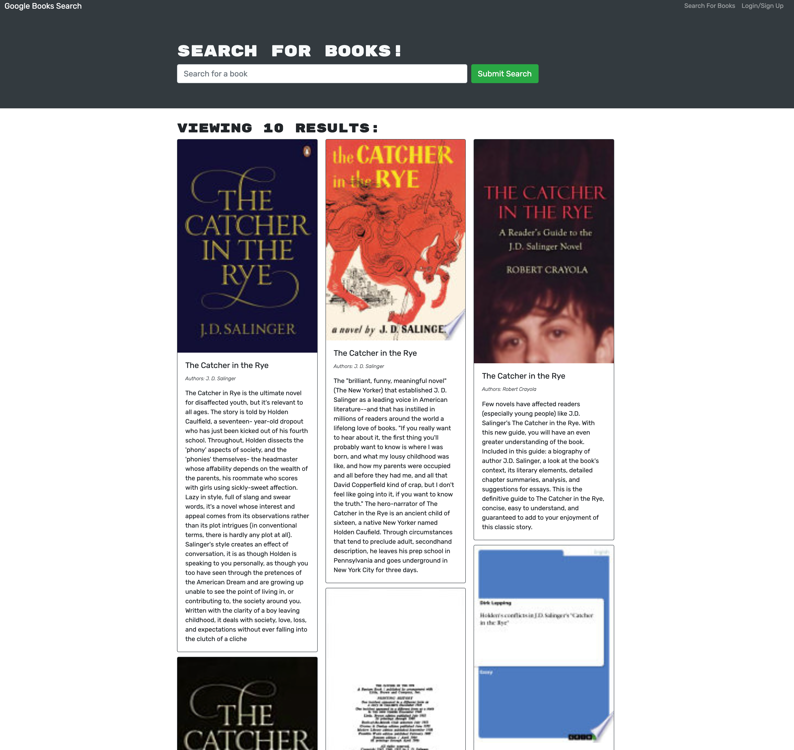

# Book Search Engine

[](https://opensource.org/licenses/MIT)

## Description

The Book Search Engine App gives users the opportunity to search for any book and is returned the book's title, author, description, image, and a link to that book on the Google Books site. The application also has authentication for users to sign-up and login to the search engine. On their profile page, the end user can view all of their saved books associated with their account and also has the option to remove a book.

## Table of Contents

- [Description](#description)
- [Installation](#installation)
- [Screenshot](#screenshot)
- [Deployed Application](#deployed-application)
- [License](#license)
- [Questions](#questions)

## Installation

To install necessary dependencies, please run the following command:

```
npm install
```

## Screenshot



## Deployed-Application

[Link to deployed application](https://boook-search-engine.herokuapp.com//)

## License

This project is covered under the MIT license. Visit the following link for more information on this license: [MIT](https://opensource.org/licenses/MIT)

## Questions

For any questions about the project, please contact me by either of the following links:

- Email - jordan.dubose1@gmail.com

or visit my GitHub profile:

- GitHub - [jordandub1](https://github.com/jordandub1)
